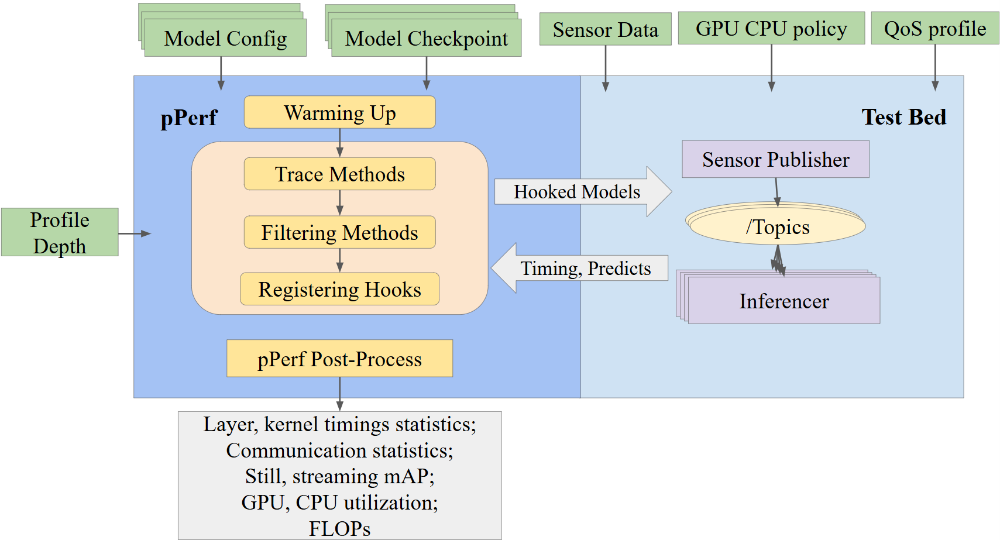
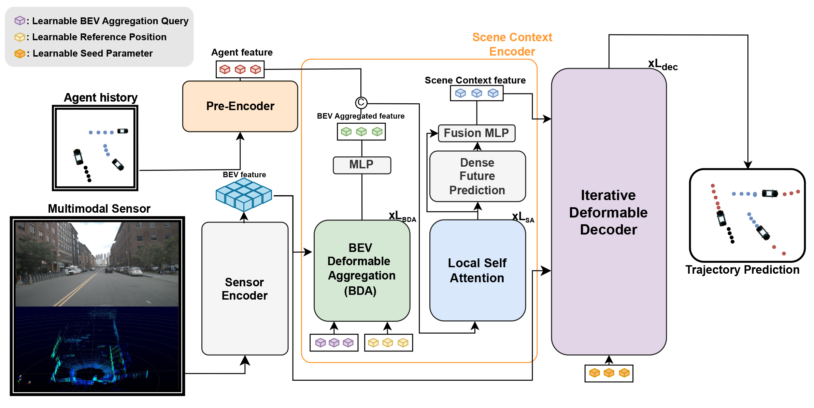

<<<<<<< HEAD
# pPerf: Multi-Tenant DNN Inference Predictability Profiler

pPerf is a suite of tools for profiling, benchmarking, and analyzing multi-model DNN inference pipelines for autonomous driving. The toolkit supports single- and multi-model inference with LiDAR, image, and multi-modal (BEVFusion) models using ROS 2 for real-time and offline replay. It includes profiling tools for timing, GPU/CPU usage, and NVTX-based CUDA tracing. Data can be published from NuScenes or replayed from ROS 2 bags. Logs include timing, predictions, and resource usage in JSON/CSV. Post-processing tools provide kernel, layer, and system-level analysis, with scripts for running standard benchmarks.



## Quick Start

1. **Install**  
   Follow this to setup: [INSTALL.md](doc/INSTALL.md).

2. **Prepare your data**  
   Download and extract the NuScenes dataset. Update paths in your config if needed. See [DATA.md](doc/DATA.md).

3. **Launch the pipeline**

   - **Start the data publisher:**
     ```bash
     ros2 run p_perf sensor_publisher.py
     ```

   - **Start the inference node (single or multi-model):**
     ```bash
     ros2 run p_perf inferencer.py
     # or
     ros2 run p_perf inferencer_ms.py
     ```

   - **(Optional) Replay a bag file:**
     ```bash
     ros2 run p_perf sensor_replayer.py
     ```

4. **View results**  
   - Profiling outputs (timing, GPU/CPU stats) are saved in your specified data directory.
   - Analyze logs and outputs for performance, accuracy, and resource usage.


## Demos
For detailed documentation on the experiment scripts, see [experiment_scripts/README.md](experiment_scripts/README.md).

To run a demo, simply execute the desired script, e.g.:
```bash
python experiment_scripts/bag_test.py
```

## Post-Processing & Analysis

The `tools/` directory provides a suite of tools for in-depth analysis of your experiments, including:

- **Layer-wise and kernel-level analysis** (e.g., `analyze_e2e_kernels.py`, `analyze_memcpy_kernels.py`)
- **Performance and sensitivity analysis** (e.g., `performance_analysis.py`, `dnn_sensitivity_analysis.py`)
- **Visualization and reporting** (e.g., `visualize_lidar_scene.py`, `priority_bar_plots.py`)
- **Scene and model variation analysis**

These tools help you interpret the results, identify bottlenecks, and optimize your models and pipelines.

## TODO

- [ ] Fix the multi-modal profiling pipeline

## Acknowledgments

pPerf builds upon and integrates atop: [LISA](https://github.com/velatkilic/LISA), [nuscenes_to_rosbag](https://github.com/WATonomous/nuscenes_to_ros2bag), [NuScenes](https://www.nuscenes.org/), [DINO](https://github.com/IDEA-Research/DINO?tab=readme-ov-file).


**Happy profiling! 🚗📊**
=======

# BEVTraj

Trajectory prediction from raw sensor data without relying on HD maps.


---

## 🛠️ Installation

🔥 BEVTraj is powered by [MMDetection3D](https://github.com/open-mmlab/mmdetection3d), [UniTraj](https://github.com/vita-epfl/UniTraj/tree/main), [Scenarionet](https://github.com/metadriverse/scenarionet) and [BEVFusion](https://github.com/mit-han-lab/bevfusion).

Follow the steps below to set up the environment and install all dependencies for BEVTraj.

### 1. Create Conda Environment & Install PyTorch

```bash
conda create -n bevtraj python=3.9
conda activate bevtraj

# Install PyTorch (adjust CUDA version as needed)
pip install torch==1.12.1+cu116 torchvision==0.13.1+cu116 torchaudio==0.12.1 --extra-index-url https://download.pytorch.org/whl/cu116
```
### 2. mmdetection3d Setup

Follow the official instructions from [mmdetection3d documentation](https://mmdetection3d.readthedocs.io/en/latest/get_started.html):

```bash
pip install -U openmim
mim install mmengine
mim install 'mmcv==2.1.0'
mim install 'mmdet==3.2.0'
```
```bash
git clone https://github.com/open-mmlab/mmdetection3d.git
cd mmdetection3d 
pip install -v -e .
```

Follow the official instructions from [BEVFusion ](https://github.com/open-mmlab/mmdetection3d/tree/main/projects/BEVFusion):

```bash
python projects/BEVFusion/setup.py develop

# Replace cu118 with your actual CUDA version if needed
pip install spconv-cu118 
```

If there are errors related to `bev_pool` or `voxel_layer` extension modules, manually copy the prebuilt `.so` files to the following directories:

```bash
cp mmdetection3d/projects/BEVFusion/bevfusion/ops/bev_pool/bev_pool_ext.*.so
bevtraj/unitraj/models/bevtraj/bevfusion/ops/bev_pool/

cp mmdetection3d/projects/BEVFusion/bevfusion/ops/voxel/voxel_layer.*.so
bevtraj/unitraj/models/bevtraj/bevfusion/ops/voxel/
```

### 3. Scenarionet Setup

Follow the official instructions from [Scenarionet](https://scenarionet.readthedocs.io/en/latest/install.html)

```bash
git clone https://github.com/metadriverse/metadrive.git
cd metadrive
pip install -e.

git clone https://github.com/metadriverse/scenarionet.git
cd scenarionet
pip install -e .
```

### 4. BEVTraj Setup

```bash
pip install -r requirements.txt
python setup.py develop
```

If you encounter any issues during setup, feel free to open an issue.

---

## 📦 Data Preparation

Please download the required datasets from the official links below:

- [nuScenes Dataset](https://www.nuscenes.org/nuscenes#download)
- [Argoverse 2 Dataset](https://argoverse.github.io/user-guide/getting_started.html)
 
```
BEVTraj/
├── data/
│   ├── nuscenes/
│   │   ├── v1.0-trainval/
│   │   └── ...
│   └── av2_sensor/
│       ├── train/
│       ├── val/
│       └── ...
```

### 📝 Generate Info Files for MMDetection3D

Run the following commands to generate the annotation info files required by MMDetection3D:

```bash
# Convert nuScenes
python mmdet3d_tools/create_data.py nuscenes \
    --root-path data/nuscenes \
    --version v1.0 \
    --out-dir data/nuscenes \
    --extra-tag BEVTraj

# Convert Argoverse 2
python mmdet3d_tools/create_data.py argo2 \
    --root-path data/av2_sensor \
    --version trainval \
    --out-dir data/av2_sensor \
    --extra-tag BEVTraj \
    --workers 8
```

### 🔄 Convert datasets for ScenarioNet

After MMDetection3D formatting, convert the data into ScenarioNet format using the following commands:

```bash
# nuScenes - Train split
python md_scenarionet/convert_nuscenes.py \
    -d data/nuscenes/train_converted \
    --split train \
    --dataroot data/nuscenes \
    --num_workers 1

# nuScenes - Val split
python md_scenarionet/convert_nuscenes.py \
    -d data/nuscenes/val_converted \
    --split val \
    --dataroot data/nuscenes \
    --num_workers 1

# Argoverse 2 - Train split
python md_scenarionet/convert_argoverse2.py \
    -d data/av2_sensor/train_converted \
    --raw_data_path data/av2_sensor/train \
    --num_workers 4

# Argoverse 2 - Val split
python md_scenarionet/convert_argoverse2.py \
    -d data/av2_sensor/val_converted \
    --raw_data_path data/av2_sensor/val \
    --num_workers 4
```

Download the pretrained BEVFusion segmentation checkpoint from the link below and place it in the `pretraining_ckpt/` directory:
- [BEVFusion github](https://github.com/mit-han-lab/bevfusion?tab=readme-ov-file#bev-map-segmentation-on-nuscenes-validation)
- [📎 Download pretrained weight](https://www.dropbox.com/scl/fi/8lgd1hkod2a15mwry0fvd/bevfusion-seg.pth?rlkey=2tmgw7mcrlwy9qoqeui63tay9&dl=1)

---

## Train

```bash
# nuscenes
python unitraj/train.py method=bevtraj_nusc

# argoverse 2 sensor
python unitraj/train.py method=bevtraj_av2sensor

```

To enable multi-GPU training using Distributed Data Parallel (DDP), configure the `devices` option in your `config.yaml` file.

For example:

```yaml
devices: [0, 1, 2, 3]
```

## License

This project is licensed under the MIT License.  

## Acknowledgments

This project builds upon the work of several open-source libraries and prior research.  
Special thanks to the authors of the following projects:

- [MMDetection3D](https://github.com/open-mmlab/mmdetection3d)
- [BEVFusion](https://github.com/mit-han-lab/bevfusion)
- [UniTraj](https://github.com/vita-epfl/UniTraj)
- [ScenarioNet](https://github.com/metadriverse/scenarionet)

We thank the open-source community for their invaluable tools and contributions.
>>>>>>> 28b2bdf095ecd8ed22d349e628aa9f86804b9778
