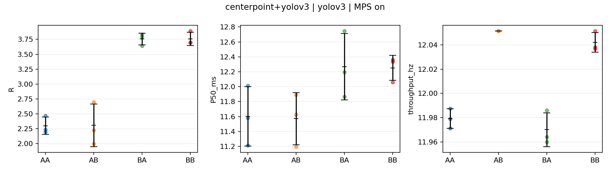

# Input2 crossed: findings and evidence

All **216 execution slots** passed offline validation: 56 isolated, 40 screening, and 120 confirmation slots. They use **196 distinct compatible executions**, with 20 screening AA/BB executions also supplying confirmation repetition one. Exactly 100 new confirmation executions were needed. All 16 ordered scene bags passed read-back validation; ten A/B selections are frozen. Four excluded new attempts and all 40 rejected historical screening candidates remain retained. No condition has an unresolved evidence blocker.

The [experiment manifest](../../../generated_configs/input2-crossed/experiment_manifest.json), [frozen selections](selection.json), [full report](report.md), and [individual-run results](per_run_summaries.csv) retain the complete identities and evidence. The first cell letter selects LiDAR input; the second selects camera input. Values below are execution-level mean differences in R=(P99−P50)/P50 across three repetitions. A consistent sign across three repetitions is descriptive support, not a significance test or a resolved GPU mechanism.

## Controlled input effects

**CenterPoint + YOLOv3, MPS on:** A=0245, B=0184. Changing only CenterPoint's LiDAR input increased YOLOv3 R by **1.454 ± 0.245 SD** for BA−AA and **1.453 ± 0.398 SD** for BB−AB. Every repetition was positive at both fixed camera inputs. Restricting comparisons to common processed camera frames preserves this result: differences span 1.171–1.596 and 0.994–1.700, respectively. This supports a co-runner input effect under this protocol; changed camera-frame coverage alone does not explain it. The internal contention mechanism remains unresolved.

**CenterPoint + DINO:** A=0245, B=0184 in both modes. DINO's LiDAR co-runner contrasts are +0.303 and +0.339 with MPS off, and +0.212 and +0.236 with MPS on. All three repetitions and their common-frame comparisons retain positive signs at both camera inputs. CenterPoint's own tail estimates in this pair require particular caution because 18 of its 24 confirmation measurements have fewer than 100 completed inferences.

**PointPillars + Mask R-CNN:** With MPS off, A=0770 and B=0184. PointPillars' own-input contrasts are +0.282 and +0.376, versus +0.0161 for the single corresponding isolated comparison. This is a substantial difference between paired and isolated behavior, with a +0.0936 four-cell interaction. Isolation has only one execution per scene, so its repetition uncertainty is unknown. With MPS on, the selected scenes are A=0184 and B=0398: PointPillars' camera co-runner contrasts are +0.122 and +0.195. Mask R-CNN's LiDAR co-runner effects change sign with its own input (−0.0578 and +0.0400), with +0.0978 interaction. These selected off/on contrasts involve different scenes and must not be treated as direct mode comparisons.

**PointPillars + ViT-UPerNet:** With MPS off, A=0245 and B=0398. PointPillars' own-input contrasts are −0.0115 and −0.0100, compared with −0.0177 in isolation; its co-runner contrasts span zero across repetitions. ViT-UPerNet has a +0.0843 co-runner effect at camera A, while the effect at camera B is less stable. With MPS on, A=0184 and B=0398: PointPillars' camera co-runner effect is clear at LiDAR B (+0.1314), while the corresponding effect at A spans zero. ViT-UPerNet's LiDAR co-runner effects are consistently negative (−0.0756 and −0.0620). This pair has input-dependent behavior rather than one shared sensitivity label.

Complete results for both models in every block, including P50, P99, throughput, processed-frame counts, own-input effects versus isolation, and interaction, are in the [individual contrasts](four_cell_contrasts.csv), [contrast summaries](four_cell_contrast_summary.csv), and [four-cell summaries](four_cell_summary.csv). Each plot shows individual executions and mean ± sample SD; tables also retain minima, maxima, and ranges. [MPS comparisons](mps_matched_scenes.csv) use only matching actual scene combinations.

## 3DSSD and YOLOv3 assessed separately

**3DSSD:** MPS-off R effects are small relative to the large effects above: own-input means are +0.0093 and +0.0032, with repetition ranges crossing zero. With MPS on, own-input effects are +0.0175 and −0.0046 at the two fixed camera scenes, and the interaction is −0.0222. Small effects do not establish equivalence; no insensitivity margin was specified.

**YOLOv3 with 3DSSD:** MPS-off own-input effects are +0.0928 and +0.0410, both positive in every repetition, compared with −0.0453 for the single isolated scene contrast. Co-runner effects are +0.0104 and −0.0414, with consistent signs at their respective fixed camera inputs. MPS-on estimates vary more across repetitions. The pair therefore should **not be described as an insensitive control** on these measurements.

## Coverage, archives, and limitations

Across confirmation model-execution rows, 73,956 bag inputs were expected, 73,751 relay publications were observed, and 58,648 inferences completed. There were 205 upstream missing inputs and 15,103 published inputs absent from model callbacks (dropped/overwritten coverage, without identifying a queue-internal cause). Failed inferences, relay publication failures, unmatched inputs, and duplicate inputs were zero. Source IDs are retained in per-run coverage exports and [common-frame comparisons](common_processed_frames.json). Scheduled bag inputs are never counted as observed publications.

The [kernel coverage export](kernel_attribution_coverage.csv) covers **63,140,906 kernels** from 196 distinct executions. Model attribution covers 100% of kernel count and summed GPU duration. Completed-input attribution covers 97.725% of kernel count and 97.679% of GPU duration; unresolved input records remain exported, including warmup kernels. Module annotation coverage is 98.628% by count and 98.386% by duration, but these are the existing depth-zero/root annotations, **not full layer attribution**. Resolving layers and internal contention mechanisms would require finer module/layer ranges and correlated launches. No additional detail runs were scheduled.

The [trace archive index](trace_archive_index.json) verifies both full Nsight and SQLite archives for 240 distinct retained run identities: 196 eligible executions, four excluded new attempts, and 40 rejected historical candidates. Repeated index entries record different reuse roles. Historical full-scene runs were not trimmed to claim compatibility.

Every P99 estimate is based on fewer than 1,000 observations; 25 of the 376 reported model-execution rows have fewer than 100, including 18 confirmation rows. These are explicitly flagged in [sample warnings](sample_warnings.json). Sequential frames are temporally dependent, and selection-conditioned AA/BB reuse can make selected differences optimistic. Screening differences are associations; the crossed comparisons support the specified input interventions, with the limitations above, and do not establish internal GPU mechanisms.

Prioritize longer matched recordings for CenterPoint with DINO, where P99 is especially fragile, and for confirmation of the large YOLOv3 tail effects with CenterPoint. Use a separately specified longer common window when suitable source recordings exist; do not extend this completed matrix automatically. [Per-condition recommendations](longer_measurement_candidates.json) retain counts and priorities.

Focused validation passed (59 broad focused checks and nine final analyzer checks). Cross-package colcon validation reported 528 tests, two unrelated failures from the absent `studies/section4_1/study.yaml` fixture, and one skip; its inspected logs remain under `generated_configs/input2-crossed/validation/`.
