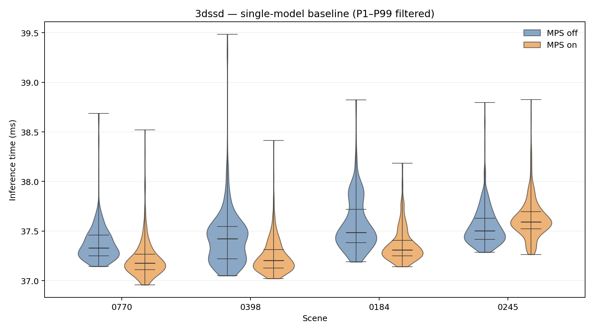
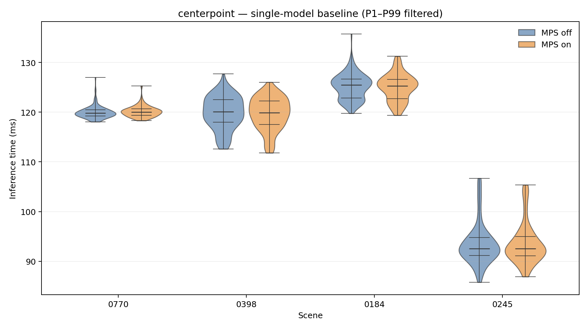
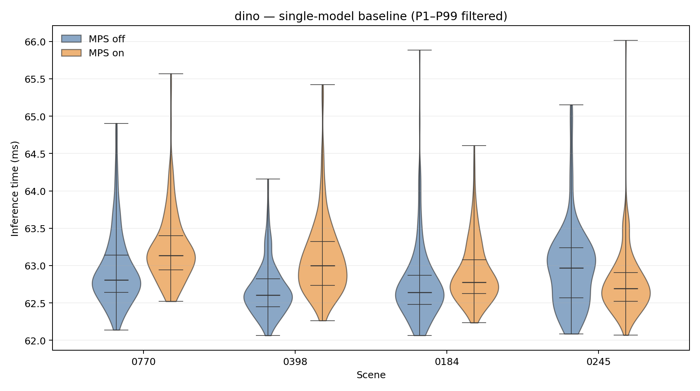
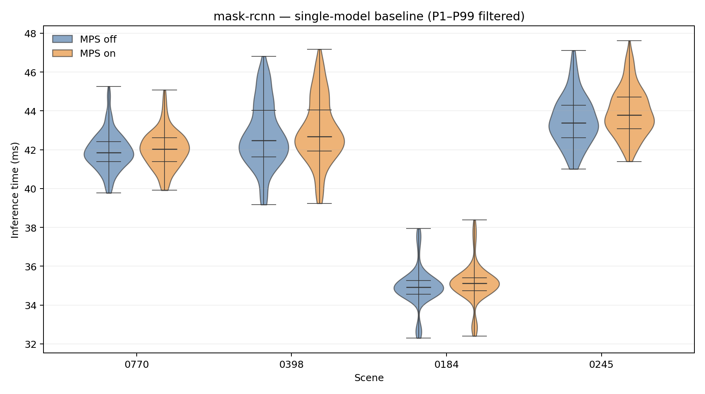
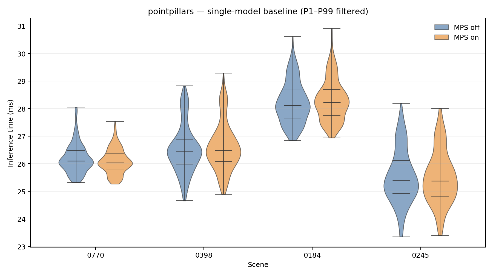
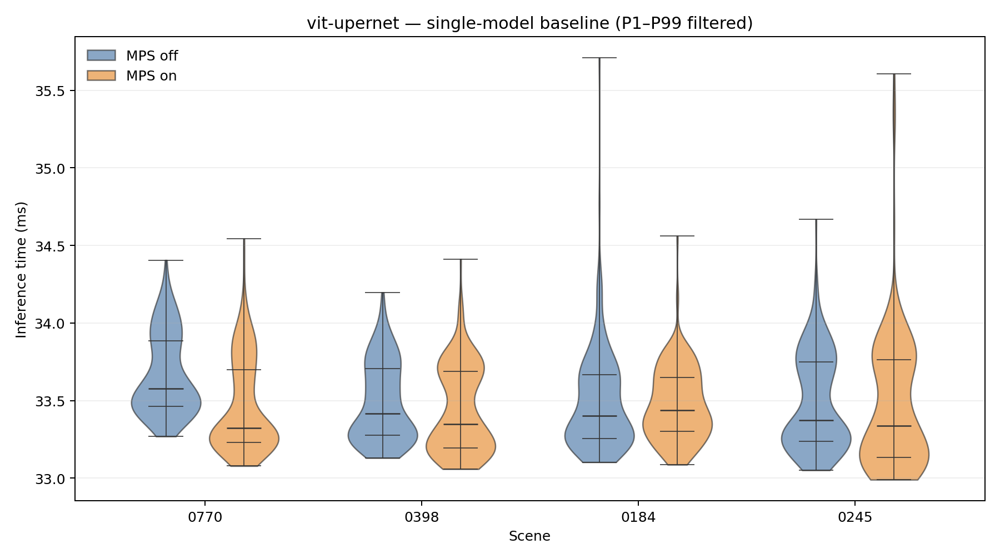
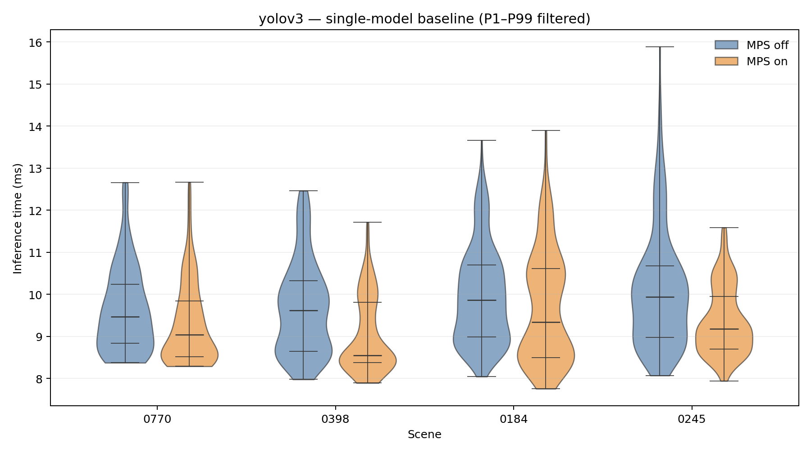

# Single-model baseline inference times

Scenes are on the x-axis; CUDA-complete inference time in milliseconds is on the y-axis. Each model has one plot with MPS-off (blue, left) and MPS-on (orange, right) next to each other at each scene. Each violin uses the same P1–P99-filtered observations as the analysis metrics. Original per-execution cutoffs use NumPy linear percentiles; metrics are recomputed after filtering. Raw recordings and the historical execution selection remain unchanged. External decode and preprocessing are excluded from this inference range. Counts, unique source-frame counts, cutoffs, and omitted counts are retained in the linked table; missing evidence is left empty. Within-execution frames are temporally dependent and are not independent repetitions.

[Download all models as a multipage PDF](plots/isolated/isolated_baselines.pdf) · [Display cutoffs and sample counts](isolated_violin_display.csv)

## 3dssd

## centerpoint

## dino

## mask-rcnn

## pointpillars

## vit-upernet

## yolov3

