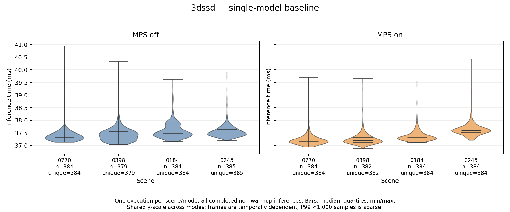
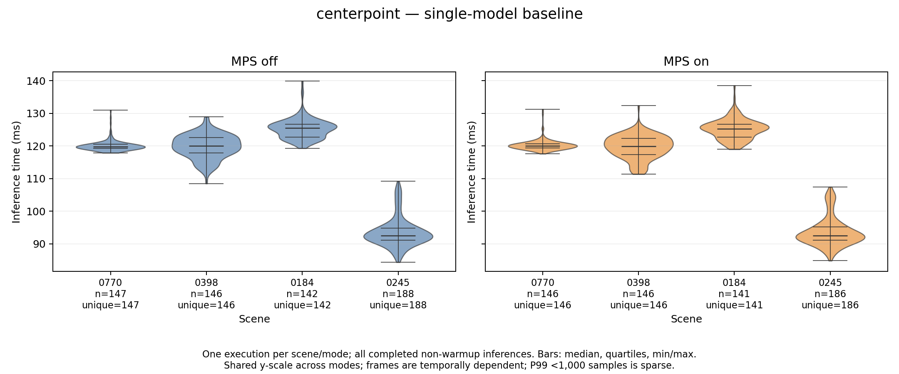
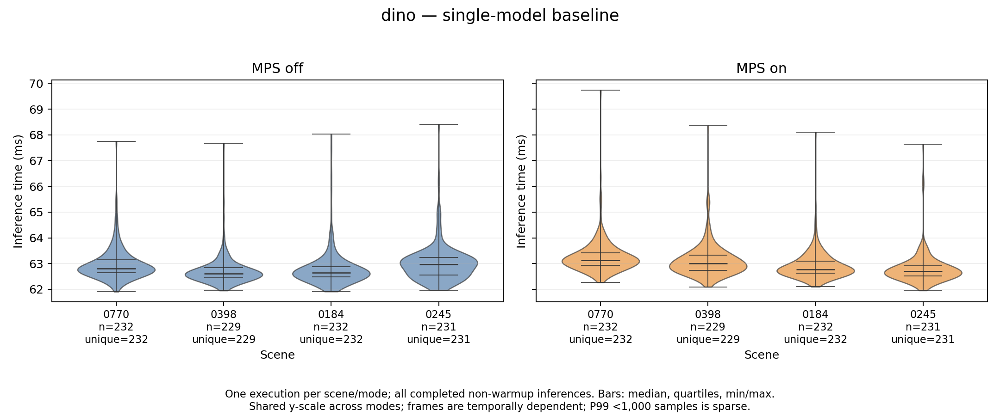
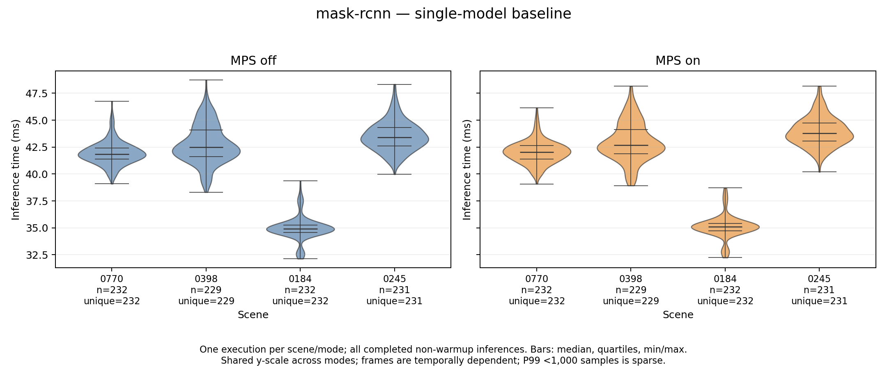
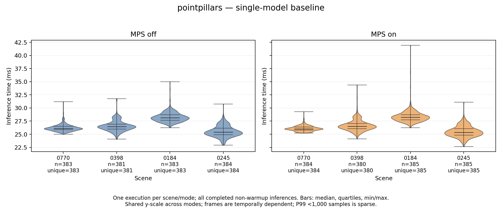
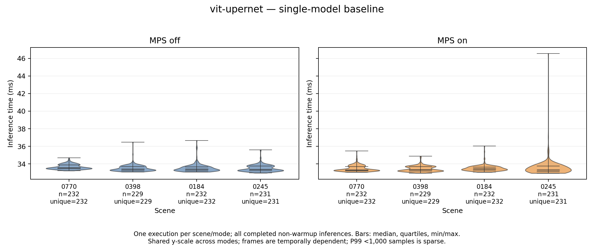
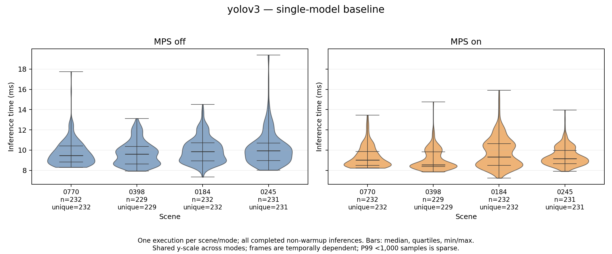

# Single-model baseline inference times

Scenes are on the x-axis; CUDA-complete inference time in milliseconds is on the y-axis. Each model has separate MPS-off and MPS-on panels sharing a y-scale. Each violin contains all completed non-warmup observations from one isolated execution, without tail trimming. Decode and preprocessing are excluded from this inference range. Counts and unique source-frame counts appear under each scene; missing evidence is left empty. Within-execution frames are temporally dependent and are not independent repetitions.

[Download all models as a multipage PDF](plots/isolated/isolated_baselines.pdf)

## 3dssd

## centerpoint

## dino

## mask-rcnn

## pointpillars

## vit-upernet

## yolov3

